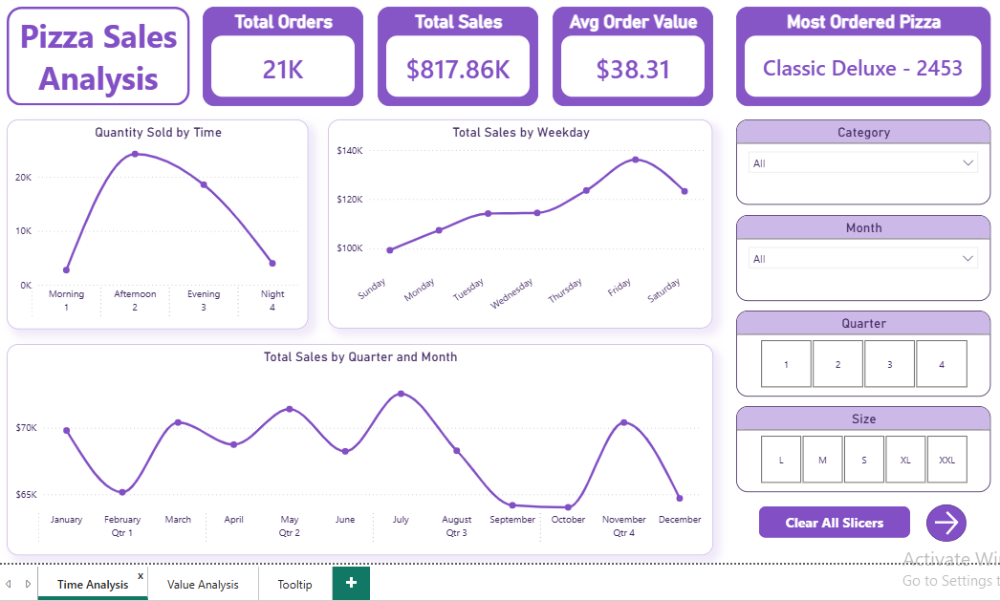
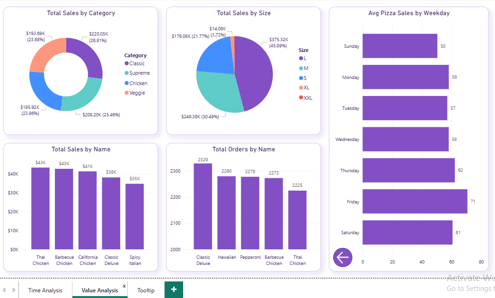
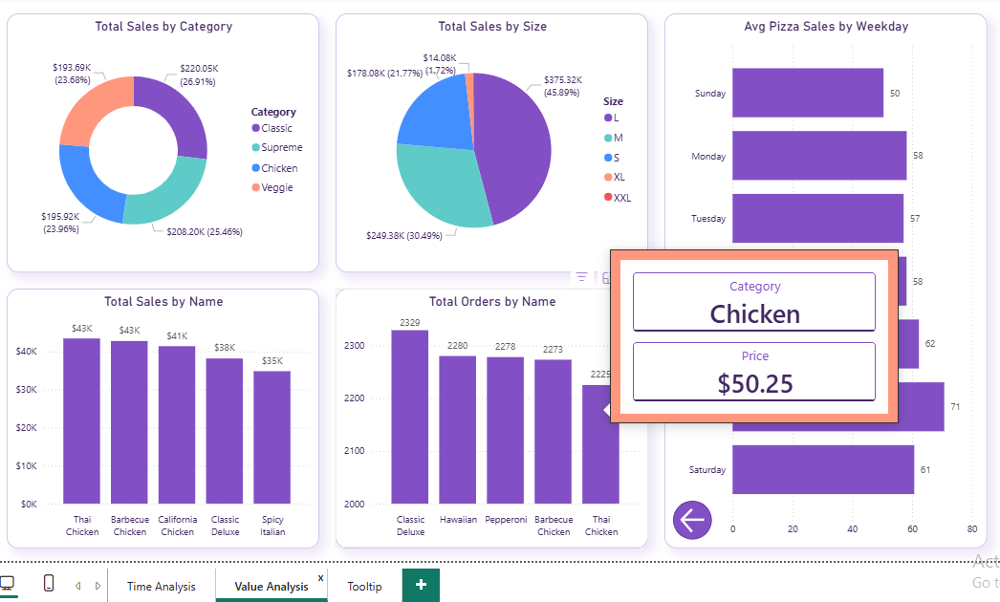

# 🍕 Pizza Sales Analysis Dashboard

## 📌 Project Overview

This project focuses on analyzing pizza sales data using Power BI to identify sales trends, customer behavior, top-performing pizzas, and business improvement opportunities.

The dataset was cleaned in Excel and visualized in Power BI using interactive dashboards, slicers, KPIs, and charts.

## 🛠️ Tools Used

- Excel (Data Cleaning)
- Power BI (Dashboard & Visualization)
- DAX (Measures & KPIs)

## 📂 Dataset Information

The project uses 4 CSV files:

| File Name | Rows |
|------------|------|
| order_details.csv | 48,621 |
| orders.csv | 21,351 |
| pizza_types.csv | 32 |
| pizzas.csv | 96 |

## 📊 Dashboard Features

### Page 1 - Time Analysis
- KPI Cards
- Sales Trends
- Order Trends
- Time-based Analysis
- Interactive Slicers
- Buttons to Clear Filters and Pag Navigation

### Page 2 - Sales & Value Analysis
- Category-wise Sales
- Size-wise Sales
- Revenue Analysis
- Top Performing Pizzas
- Average Pizza Sales on Weekdays

### Page 3 - Tooltip Page
- Custom Tooltip Visual connected with charts

## 🔍 Key Insights

1. Highest Orders: Afternoon  
2. Lowest Orders: Morning  

3. Highest Sales Days: Friday & Saturday  
   - Possible reason: Weekend parties and gatherings  

4. Lowest Sales Day: Sunday  

5. Total Sales Generated: $817.86K  

6. Most Ordered Pizza:
   - Classic Deluxe Pizza (2453 orders)

7. Highest Revenue Generating Pizza:
   - Thai Chicken Pizza ($43K)

8. Most Selling Pizza Category:
   - Classic Category

9. Most Selling Pizza Size:
   - Large (L)

10. Least Selling Sizes:
   - XXL and XL
   - XXL has negligible demand
   - XL contributes only 1.72% of total sales

## 💡 Business Recommendations

- Business demand patterns suggest the shop may be located near offices or commercial areas
- Discontinue XXL and XL pizzas due to extremely low demand
- Reduce inventory waste using Average Weekday Sales Analysis
- Offer discounts during September and October to boost low sales
- Launch Christmas and New Year offers in December
- Add more pizzas around the $50 price range since they generate higher revenue

## 📸 Dashboard Screenshots

### Dashboard Overview

### Sales Analysis

### Tooltip

## 📁 Project Files

- Dataset CSV files
- Power BI Dashboard (.pbix)
- Dashboard Screenshots
- Project Documentation

## 🚀 Future Improvements

- Add customer segmentation analysis
- Add profit margin analysis
- Create mobile-friendly dashboard layout
